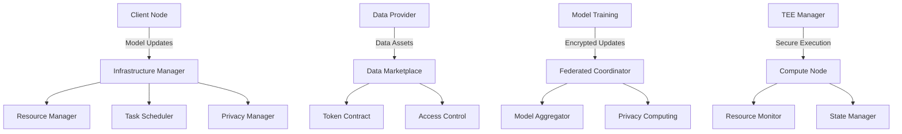

# Cipher Nexus

<div align="center">
  
</div>

A privacy-preserving AI framework that enables secure federated learning and data marketplace, protecting data privacy while advancing AI capabilities.

[English](README.md) | [中文](README_CN.md)

## Overview

Cipher Nexus is a comprehensive AI framework that combines federated learning with privacy-preserving computing and secure data marketplace capabilities. It enables collaborative machine learning while ensuring data privacy and security through advanced cryptographic techniques and trusted execution environments.

The framework addresses key challenges in AI development:
- **Data Privacy**: Protecting sensitive data during model training and inference
- **Collaborative Learning**: Enabling multiple parties to train AI models without sharing raw data
- **Data Monetization**: Creating a secure marketplace for high-quality training data
- **Model Security**: Ensuring model integrity and preventing unauthorized access

## Core Features

- **Advanced AI Capabilities**
  - Distributed model training with federated learning
  - Secure model aggregation and update mechanisms
  - Privacy-preserving inference and prediction
  - Support for various AI model architectures

- **Privacy Computing Infrastructure**
  - Differential privacy for dataset protection
  - Homomorphic encryption for secure computation
  - Zero-knowledge proofs for verification
  - Secure multi-party computation protocols

- **Trusted Execution Environment**
  - Secure enclave for sensitive computations
  - Hardware-level isolation and protection
  - Remote attestation mechanisms
  - Secure key management

- **Data Marketplace**
  - Tokenized data assets with access control
  - Quality assessment and verification
  - Secure data exchange protocols
  - Fair pricing mechanisms

- **Token Economy**
  - Incentive mechanism for data sharing
  - Rewards for model training contributions
  - Governance token for protocol decisions
  - Staking mechanisms for security

## Architecture



## Modules

- `@ciphernx/ai`: Federated learning and model management
  - Implementation of federated learning protocols
  - Model training and aggregation
  - Privacy protection mechanisms
  - Support for popular AI frameworks
  - Secure model serving and inference
  
- `@ciphernx/core`: Infrastructure and resource management
  - Compute node management
  - Resource allocation
  - Task scheduling
  - Performance monitoring
  - Fault tolerance
  
- `@ciphernx/crypto`: Cryptographic primitives and protocols
  - Homomorphic encryption
  - Zero-knowledge proofs
  - Secure multi-party computation
  - Key management
  - Privacy budgeting
  
- `@ciphernx/protocol`: Network protocols and data marketplace
  - Data asset management
  - Access control
  - Transaction processing
  - Quality verification
  - Reputation system
  
- `@ciphernx/ui`: User interface components
  - Dataset management
  - Model training monitoring
  - System management interface
  - Analytics dashboard
  - Privacy settings control

## Quick Start

1. Install dependencies
```bash
npm install
```

2. Start development server
```bash
npm run dev
```

3. Build project
```bash
npm run build
```

## Documentation

- [API Documentation](https://github.com/ciphernx/Cipher-Nexus/blob/main/docs/API.md)
- [Architecture Design](https://github.com/ciphernx/Cipher-Nexus/blob/main/docs/ARCHITECTURE.md)
- [Deployment Guide](https://github.com/ciphernx/Cipher-Nexus/blob/main/docs/DEPLOYMENT.md)
- [Development Guide](https://github.com/ciphernx/Cipher-Nexus/blob/main/docs/DEVELOPMENT.md)

## License

MIT License 

## FAQ

### Why does AI need privacy?
- Data Security: AI training requires large amounts of data that often contains sensitive information (personal information, trade secrets, etc.)
- Legal Compliance: Global data protection regulations (such as GDPR, CCPA) have strict requirements for data privacy
- User Trust: Protecting user privacy is key to building user trust and affects AI system adoption rates
- Abuse Prevention: Prevents AI models from being used for unauthorized purposes or exploited by malicious attackers
- Cross-organizational Collaboration: Enables different organizations to collaborate on AI while protecting their respective data privacy

### What are the features of our AI privacy framework?
- Comprehensive Privacy Protection Mechanisms:
  * Federated learning supports distributed training
  * Differential privacy protects individual data
  * Homomorphic encryption enables encrypted computation
  * Zero-knowledge proofs ensure computation correctness
- Trusted Execution Environment (TEE) guarantees
- Flexible data marketplace mechanism
- Token economy incentive system
- Modular design for easy extension
- Complete privacy metrics and audit mechanisms

### Why use our framework?
- One-stop Solution: Integrates mainstream privacy computing technologies
- Performance Optimization: Maintains efficiency while protecting privacy
- Easy to Use: Provides friendly APIs and comprehensive documentation
- Secure and Reliable: Multi-level security guarantee mechanisms
- Community Support: Continuous improvement through open source
- Compliance: Complies with mainstream privacy protection regulations

### Who can use our privacy framework and under what requirements?
- Target Users:
  * Enterprise AI teams
  * Research institutions
  * Healthcare organizations
  * Financial institutions
  * Government departments
  * Data service providers
  
- Application Scenarios:
  * Cross-organizational data collaboration
  * Medical data analysis
  * Financial risk control modeling
  * Privacy-preserving recommendation systems
  * Secure multi-party computation
  * AI applications requiring strict data protection

### How do we empower cryptocurrency?
- Token Economy System Design:
  * Utility tokens for computing resources and data access
  * Governance tokens for community governance
  * Incentive mechanisms for data providers and validators
  * Tokenized data assets
- Privacy Protection Integration:
  * Zero-knowledge proofs for transaction verification
  * Homomorphic encryption for encrypted token computation
  * Secure multi-party computation for private transactions
  * Ring signatures for transaction anonymity
- Smart Contract Features:
  * Automated Market Maker (AMM)
  * Decentralized trading
  * Staking contracts
  * Governance contracts
- Economic Model Innovation:
  * Dual-token model
  * Dynamic pricing mechanism
  * Deflationary mechanism
  * Liquidity mining
- Cross-chain Interoperability:
  * Cross-chain asset transfer
  * Cross-chain messaging
  * Atomic swaps
  * Asset bridges
- Security Guarantees:
  * Multi-signature wallets
  * Time locks
  * Oracle integration
  * Emergency pause
- Ecosystem Development:
  * Developer incentives
  * Community building
  * Partnership programs
  * Decentralized Autonomous Organization (DAO)

## 常见问题

### AI 为什么需要隐私？
- 数据安全：AI 训练需要大量数据，这些数据往往包含敏感信息（个人信息、商业机密等）
- 法律合规：全球各地的数据保护法规（如 GDPR、CCPA）对数据隐私提出了严格要求
- 用户信任：保护用户隐私是建立用户信任的关键，影响 AI 系统的采用率
- 防止滥用：避免 AI 模型被用于未经授权的目的或被恶意攻击者利用
- 跨组织协作：使不同组织能够在保护各自数据隐私的前提下进行 AI 协作

### 我们的 AI 隐私框架有什么特点？
- 全面的隐私保护机制：
  * 联邦学习支持分布式训练
  * 差分隐私保护个体数据
  * 同态加密实现加密计算
  * 零知识证明确保计算正确性
- 可信执行环境（TEE）保障
- 灵活的数据市场机制
- 代币经济激励系统
- 模块化设计便于扩展
- 完整的隐私度量和审计机制

### 为什么要使用我们的框架？
- 一站式解决方案：集成了主流隐私计算技术
- 性能优化：在保护隐私的同时保持高效率
- 易于使用：提供友好的 API 和完善的文档
- 安全可靠：多层次的安全保障机制
- 社区支持：开源项目持续改进
- 合规性：符合主流隐私保护法规

### 谁可以在什么需求下使用我们的隐私框架？
- 适用人群：
  * 企业 AI 团队
  * 研究机构
  * 医疗机构
  * 金融机构
  * 政府部门
  * 数据服务提供商
  
- 适用场景：
  * 跨组织数据协作
  * 医疗数据分析
  * 金融风控建模
  * 隐私保护的推荐系统
  * 多方安全计算
  * 需要严格数据保护的 AI 应用

### 我们是如何赋能加密货币的？
- 代币经济系统设计：
  * 实用代币用于支付计算资源和数据访问
  * 治理代币用于社区治理和决策
  * 激励机制奖励数据提供者和验证者
  * 通证化数据资产
- 隐私保护机制与加密货币的结合：
  * 零知识证明验证交易合法性
  * 同态加密支持加密状态下的计算
  * 安全多方计算实现隐私保护交易
  * 环签名提供交易匿名性
- 智能合约功能：
  * 自动化市场制造者(AMM)
  * 去中心化交易
  * 质押合约
  * 治理合约
- 经济模型创新：
  * 双通证模型
  * 动态定价机制
  * 通缩机制
  * 流动性挖矿
- 跨链互操作：
  * 跨链资产转移
  * 跨链消息传递
  * 原子交换
  * 资产桥接
- 安全保障：
  * 多重签名钱包
  * 时间锁定
  * 预言机整合
  * 紧急暂停
- 生态系统建设：
  * 开发者激励
  * 社区建设
  * 合作伙伴计划
  * 去中心化自治组织(DAO) 