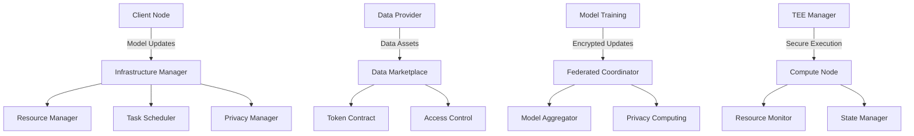

# Cipher Nexus

<div align="center">
  
</div>

A privacy-preserving AI framework that enables secure federated learning and data marketplace, protecting data privacy while advancing AI capabilities.

[English](README.md) | [中文](README_CN.md)

## Overview

Cipher Nexus is a comprehensive AI framework that combines federated learning with privacy-preserving computing and secure data marketplace capabilities. It enables collaborative machine learning while ensuring data privacy and security through advanced cryptographic techniques and trusted execution environments.

The framework addresses key challenges in AI development:
- **Data Privacy**: Protecting sensitive data during model training and inference
- **Collaborative Learning**: Enabling multiple parties to train AI models without sharing raw data
- **Data Monetization**: Creating a secure marketplace for high-quality training data
- **Model Security**: Ensuring model integrity and preventing unauthorized access

## Core Features

- **Advanced AI Capabilities**
  - Distributed model training with federated learning
  - Secure model aggregation and update mechanisms
  - Privacy-preserving inference and prediction
  - Support for various AI model architectures

- **Privacy Computing Infrastructure**
  - Differential privacy for dataset protection
  - Homomorphic encryption for secure computation
  - Zero-knowledge proofs for verification
  - Secure multi-party computation protocols

- **Trusted Execution Environment**
  - Secure enclave for sensitive computations
  - Hardware-level isolation and protection
  - Remote attestation mechanisms
  - Secure key management

- **Data Marketplace**
  - Tokenized data assets with access control
  - Quality assessment and verification
  - Secure data exchange protocols
  - Fair pricing mechanisms

- **Token Economy**
  - Incentive mechanism for data sharing
  - Rewards for model training contributions
  - Governance token for protocol decisions
  - Staking mechanisms for security

## Architecture



## Modules

- `@ciphernx/ai`: Federated learning and model management
  - Implementation of federated learning protocols
  - Model training and aggregation
  - Privacy protection mechanisms
  - Support for popular AI frameworks
  - Secure model serving and inference
  
- `@ciphernx/core`: Infrastructure and resource management
  - Compute node management
  - Resource allocation
  - Task scheduling
  - Performance monitoring
  - Fault tolerance
  
- `@ciphernx/crypto`: Cryptographic primitives and protocols
  - Homomorphic encryption
  - Zero-knowledge proofs
  - Secure multi-party computation
  - Key management
  - Privacy budgeting
  
- `@ciphernx/protocol`: Network protocols and data marketplace
  - Data asset management
  - Access control
  - Transaction processing
  - Quality verification
  - Reputation system
  
- `@ciphernx/ui`: User interface components
  - Dataset management
  - Model training monitoring
  - System management interface
  - Analytics dashboard
  - Privacy settings control

## Quick Start

1. Install dependencies
```bash
npm install
```

2. Start development server
```bash
npm run dev
```

3. Build project
```bash
npm run build
```

## Documentation

- [API Documentation](docs/API.md)
- [Architecture Design](docs/ARCHITECTURE.md)
- [Deployment Guide](docs/DEPLOYMENT.md)
- [Development Guide](docs/DEVELOPMENT.md)

## License

MIT License 