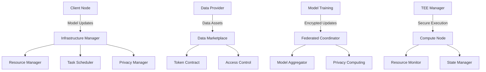

# Cipher Nexus

<div align="center">
  
</div>

A privacy-preserving AI framework that enables secure federated learning and data marketplace, protecting data privacy while advancing AI capabilities.

[English](README.md) | [中文](README_CN.md)

## Overview

Cipher Nexus is a comprehensive AI framework that combines federated learning with privacy-preserving computing and secure data marketplace capabilities. It enables collaborative machine learning while ensuring data privacy and security through advanced cryptographic techniques and trusted execution environments.

The framework addresses key challenges in AI development:
- **Data Privacy**: Protecting sensitive data during model training and inference
- **Collaborative Learning**: Enabling multiple parties to train AI models without sharing raw data
- **Data Monetization**: Creating a secure marketplace for high-quality training data
- **Model Security**: Ensuring model integrity and preventing unauthorized access

## Core Features

- **Advanced AI Capabilities**
  - Distributed model training with federated learning
  - Secure model aggregation and update mechanisms
  - Privacy-preserving inference and prediction
  - Support for various AI model architectures

- **Privacy Computing Infrastructure**
  - Differential privacy for dataset protection
  - Homomorphic encryption for secure computation
  - Zero-knowledge proofs for verification
  - Secure multi-party computation protocols

- **Trusted Execution Environment**
  - Secure enclave for sensitive computations
  - Hardware-level isolation and protection
  - Remote attestation mechanisms
  - Secure key management

- **Data Marketplace**
  - Tokenized data assets with access control
  - Quality assessment and verification
  - Secure data exchange protocols
  - Fair pricing mechanisms

- **Token Economy**
  - Incentive mechanism for data sharing
  - Rewards for model training contributions
  - Governance token for protocol decisions
  - Staking mechanisms for security

## Architecture



## Modules

- `@ciphernx/ai`: Federated learning and model management
  - Implementation of federated learning protocols
  - Model training and aggregation
  - Privacy protection mechanisms
  - Support for popular AI frameworks
  - Secure model serving and inference
  
- `@cipher-nexus/core`: Infrastructure and resource management
  - Compute node management
  - Resource allocation
  - Task scheduling
  - Performance monitoring
  - Fault tolerance
  
- `@ciphernx/crypto`: Cryptographic primitives and protocols
  - Homomorphic encryption
  - Zero-knowledge proofs
  - Secure multi-party computation
  - Key management
  - Privacy budgeting
  
- `@ciphernx/protocol`: Network protocols and data marketplace
  - Data asset management
  - Access control
  - Transaction processing
  - Quality verification
  - Reputation system
  
- `@ciphernx/ui`: User interface components
  - Dataset management
  - Model training monitoring
  - System management interface
  - Analytics dashboard
  - Privacy settings control

## Quick Start

1. Install dependencies
```bash
npm install
```

2. Start development server
```bash
npm run dev
```

3. Build project
```bash
npm run build
```

## Documentation

- [API Documentation](https://github.com/ciphernx/Cipher-Nexus/blob/main/docs/API.md)
- [Architecture Design](https://github.com/ciphernx/Cipher-Nexus/blob/main/docs/ARCHITECTURE.md)
- [Deployment Guide](https://github.com/ciphernx/Cipher-Nexus/blob/main/docs/DEPLOYMENT.md)
- [Development Guide](https://github.com/ciphernx/Cipher-Nexus/blob/main/docs/DEVELOPMENT.md)

## License

MIT License 

## FAQ

### Why does AI need privacy?
- Data Security: AI training requires large amounts of data that often contains sensitive information (personal information, trade secrets, etc.)
- Legal Compliance: Global data protection regulations (such as GDPR, CCPA) have strict requirements for data privacy
- User Trust: Protecting user privacy is key to building user trust and affects AI system adoption rates
- Abuse Prevention: Prevents AI models from being used for unauthorized purposes or exploited by malicious attackers
- Cross-organizational Collaboration: Enables different organizations to collaborate on AI while protecting their respective data privacy

### What are the features of our AI privacy framework?
- Comprehensive Privacy Protection Mechanisms:
  * Federated learning supports distributed training
  * Differential privacy protects individual data
  * Homomorphic encryption enables encrypted computation
  * Zero-knowledge proofs ensure computation correctness
- Trusted Execution Environment (TEE) guarantees
- Flexible data marketplace mechanism
- Token economy incentive system
- Modular design for easy extension
- Complete privacy metrics and audit mechanisms

### Why use our framework?
- One-stop Solution: Integrates mainstream privacy computing technologies
- Performance Optimization: Maintains efficiency while protecting privacy
- Easy to Use: Provides friendly APIs and comprehensive documentation
- Secure and Reliable: Multi-level security guarantee mechanisms
- Community Support: Continuous improvement through open source
- Compliance: Complies with mainstream privacy protection regulations

### Who can use our privacy framework and under what requirements?
- Target Users:
  * Enterprise AI teams
  * Research institutions
  * Healthcare organizations
  * Financial institutions
  * Government departments
  * Data service providers
  
- Application Scenarios:
  * Cross-organizational data collaboration
  * Medical data analysis
  * Financial risk control modeling
  * Privacy-preserving recommendation systems
  * Secure multi-party computation
  * AI applications requiring strict data protection

### How do we empower cryptocurrency?
- Token Economy System Design:
  * Utility tokens for computing resources and data access
  * Governance tokens for community governance
  * Incentive mechanisms for data providers and validators
  * Tokenized data assets
- Privacy Protection Integration:
  * Zero-knowledge proofs for transaction verification
  * Homomorphic encryption for encrypted token computation
  * Secure multi-party computation for private transactions
  * Ring signatures for transaction anonymity
- Smart Contract Features:
  * Automated Market Maker (AMM)
  * Decentralized trading
  * Staking contracts
  * Governance contracts
- Economic Model Innovation:
  * Dual-token model
  * Dynamic pricing mechanism
  * Deflationary mechanism
  * Liquidity mining
- Cross-chain Interoperability:
  * Cross-chain asset transfer
  * Cross-chain messaging
  * Atomic swaps
  * Asset bridges
- Security Guarantees:
  * Multi-signature wallets
  * Time locks
  * Oracle integration
  * Emergency pause
- Ecosystem Development:
  * Developer incentives
  * Community building
  * Partnership programs
  * Decentralized Autonomous Organization (DAO) 