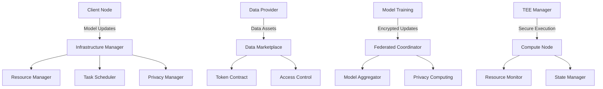
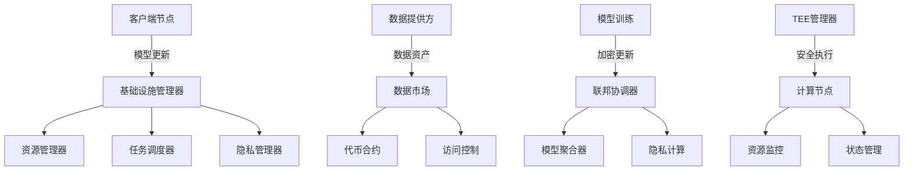

# Cipher Nexus

A privacy-preserving federated learning framework with secure data marketplace.

[English](#overview) | [中文](#chinese)

## Overview

Cipher Nexus is a comprehensive framework that combines federated learning with privacy-preserving computing and secure data marketplace capabilities. It enables collaborative machine learning while ensuring data privacy and security.

## Core Features

- **Federated Learning Protocol**: Secure distributed training with model aggregation
- **Privacy Computing**: Differential privacy, homomorphic encryption, and zero-knowledge proofs
- **Trusted Execution Environment**: Secure enclave for sensitive computations
- **Data Marketplace**: Tokenized data assets with access control
- **Token Economy**: Incentive mechanism for data sharing and model training

## Architecture



## Modules

- `@ciphernx/ai`: Federated learning and model management
  - Implementation of federated learning protocols
  - Model training and aggregation
  - Privacy protection mechanisms
  
- `@ciphernx/core`: Infrastructure and resource management
  - Compute node management
  - Resource allocation
  - Task scheduling
  
- `@ciphernx/crypto`: Cryptographic primitives and protocols
  - Homomorphic encryption
  - Zero-knowledge proofs
  - Secure multi-party computation
  
- `@ciphernx/protocol`: Network protocols and data marketplace
  - Data asset management
  - Access control
  - Transaction processing
  
- `@ciphernx/ui`: User interface components
  - Dataset management
  - Model training monitoring
  - System management interface

## Quick Start

1. Install dependencies
```bash
npm install
```

2. Start development server
```bash
npm run dev
```

3. Build project
```bash
npm run build
```

## Documentation

- [API Documentation](docs/API.md)
- [Architecture Design](docs/ARCHITECTURE.md)
- [Deployment Guide](docs/DEPLOYMENT.md)
- [Development Guide](docs/DEVELOPMENT.md)

# Chinese | 中文

## 概述

Cipher Nexus 是一个综合性框架，将联邦学习与隐私计算和安全数据市场功能相结合。它能够在确保数据隐私和安全的同时实现协作机器学习。

## 核心功能

- **联邦学习协议**：安全的分布式训练和模型聚合
- **隐私计算**：差分隐私、同态加密和零知识证明
- **可信执行环境**：敏感计算的安全飞地
- **数据市场**：带访问控制的通证化数据资产
- **代币经济**：数据共享和模型训练的激励机制

## 系统架构



## 模块说明

- `@ciphernx/ai`: 联邦学习和模型管理
  - 实现联邦学习协议
  - 模型训练和聚合
  - 隐私保护机制
  
- `@ciphernx/core`: 基础设施和资源管理
  - 计算节点管理
  - 资源分配
  - 任务调度
  
- `@ciphernx/crypto`: 密码学原语和协议
  - 同态加密
  - 零知识证明
  - 安全多方计算
  
- `@ciphernx/protocol`: 网络协议和数据市场
  - 数据资产管理
  - 访问控制
  - 交易处理
  
- `@ciphernx/ui`: 用户界面组件
  - 数据集管理
  - 模型训练监控
  - 系统管理界面

## 快速开始

1. 安装依赖
```bash
npm install
```

2. 启动开发服务器
```bash
npm run dev
```

3. 构建项目
```bash
npm run build
```

## 文档

- [API 文档](docs/API.md)
- [架构设计](docs/ARCHITECTURE.md)
- [部署指南](docs/DEPLOYMENT.md)
- [开发指南](docs/DEVELOPMENT.md)

## License

MIT License 