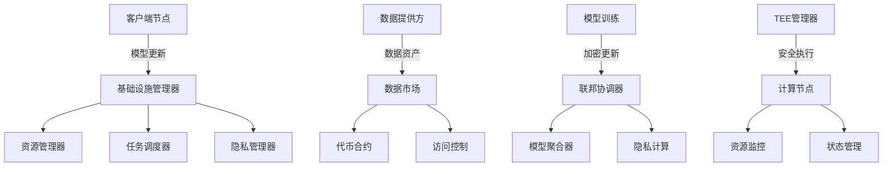

# Cipher Nexus

<div align="center">
  
</div>

一个保护数据隐私的 AI 框架，支持安全的联邦学习和数据市场，在推进 AI 能力的同时保护数据隐私。

[English](README.md) | [中文](README_CN.md)

## 概述

Cipher Nexus 是一个综合性的 AI 框架，将联邦学习与隐私计算和安全数据市场功能相结合。它通过先进的密码学技术和可信执行环境，在确保数据隐私和安全的同时实现协作机器学习。

该框架解决了 AI 开发中的关键挑战：
- **数据隐私**：在模型训练和推理过程中保护敏感数据
- **协作学习**：使多方能够在不共享原始数据的情况下训练 AI 模型
- **数据变现**：为高质量训练数据创建安全的市场
- **模型安全**：确保模型完整性并防止未授权访问

## 核心功能

- **先进的 AI 能力**
  - 基于联邦学习的分布式模型训练
  - 安全的模型聚合和更新机制
  - 隐私保护的推理和预测
  - 支持多种 AI 模型架构

- **隐私计算基础设施**
  - 用于数据集保护的差分隐私
  - 用于安全计算的同态加密
  - 用于验证的零知识证明
  - 安全多方计算协议

- **可信执行环境**
  - 用于敏感计算的安全飞地
  - 硬件级隔离和保护
  - 远程认证机制
  - 安全密钥管理

- **数据市场**
  - 带访问控制的通证化数据资产
  - 质量评估和验证
  - 安全数据交换协议
  - 公平定价机制

- **代币经济**
  - 数据共享激励机制
  - 模型训练贡献奖励
  - 用于协议决策的治理代币
  - 用于安全的质押机制

## 系统架构



## 模块说明

- `@ciphernx/ai`: 联邦学习和模型管理
  - 实现联邦学习协议
  - 模型训练和聚合
  - 隐私保护机制
  - 支持主流 AI 框架
  - 安全模型服务和推理
  
- `@cipher-nexus/core`: 基础设施和资源管理
  - 计算节点管理
  - 资源分配
  - 任务调度
  - 性能监控
  - 容错机制
  
- `@ciphernx/crypto`: 密码学原语和协议
  - 同态加密
  - 零知识证明
  - 安全多方计算
  - 密钥管理
  - 隐私预算
  
- `@ciphernx/protocol`: 网络协议和数据市场
  - 数据资产管理
  - 访问控制
  - 交易处理
  - 质量验证
  - 信誉系统
  
- `@ciphernx/ui`: 用户界面组件
  - 数据集管理
  - 模型训练监控
  - 系统管理界面
  - 分析仪表盘
  - 隐私设置控制

## 快速开始

1. 安装依赖
```bash
npm install
```

2. 启动开发服务器
```bash
npm run dev
```

3. 构建项目
```bash
npm run build
```

## 文档

- [API 文档](docs/API.md)
- [架构设计](docs/ARCHITECTURE.md)
- [部署指南](docs/DEPLOYMENT.md)
- [开发指南](docs/DEVELOPMENT.md)

## 许可证

MIT 许可证 

## 常见问题

### AI 为什么需要隐私？
- 数据安全：AI 训练需要大量数据，这些数据往往包含敏感信息（个人信息、商业机密等）
- 法律合规：全球各地的数据保护法规（如 GDPR、CCPA）对数据隐私提出了严格要求
- 用户信任：保护用户隐私是建立用户信任的关键，影响 AI 系统的采用率
- 防止滥用：避免 AI 模型被用于未经授权的目的或被恶意攻击者利用
- 跨组织协作：使不同组织能够在保护各自数据隐私的前提下进行 AI 协作

### 我们的 AI 隐私框架有什么特点？
- 全面的隐私保护机制：
  * 联邦学习支持分布式训练
  * 差分隐私保护个体数据
  * 同态加密实现加密计算
  * 零知识证明确保计算正确性
- 可信执行环境（TEE）保障
- 灵活的数据市场机制
- 代币经济激励系统
- 模块化设计便于扩展
- 完整的隐私度量和审计机制

### 为什么要使用我们的框架？
- 一站式解决方案：集成了主流隐私计算技术
- 性能优化：在保护隐私的同时保持高效率
- 易于使用：提供友好的 API 和完善的文档
- 安全可靠：多层次的安全保障机制
- 社区支持：开源项目持续改进
- 合规性：符合主流隐私保护法规

### 谁可以在什么需求下使用我们的隐私框架？
- 适用人群：
  * 企业 AI 团队
  * 研究机构
  * 医疗机构
  * 金融机构
  * 政府部门
  * 数据服务提供商
  
- 适用场景：
  * 跨组织数据协作
  * 医疗数据分析
  * 金融风控建模
  * 隐私保护的推荐系统
  * 多方安全计算
  * 需要严格数据保护的 AI 应用

### 我们是如何赋能加密货币的？
- 代币经济系统设计：
  * 实用代币用于支付计算资源和数据访问
  * 治理代币用于社区治理和决策
  * 激励机制奖励数据提供者和验证者
  * 通证化数据资产
- 隐私保护机制与加密货币的结合：
  * 零知识证明验证交易合法性
  * 同态加密支持加密状态下的计算
  * 安全多方计算实现隐私保护交易
  * 环签名提供交易匿名性
- 智能合约功能：
  * 自动化市场制造者(AMM)
  * 去中心化交易
  * 质押合约
  * 治理合约
- 经济模型创新：
  * 双通证模型
  * 动态定价机制
  * 通缩机制
  * 流动性挖矿
- 跨链互操作：
  * 跨链资产转移
  * 跨链消息传递
  * 原子交换
  * 资产桥接
- 安全保障：
  * 多重签名钱包
  * 时间锁定
  * 预言机整合
  * 紧急暂停
- 生态系统建设：
  * 开发者激励
  * 社区建设
  * 合作伙伴计划
  * 去中心化自治组织(DAO) 